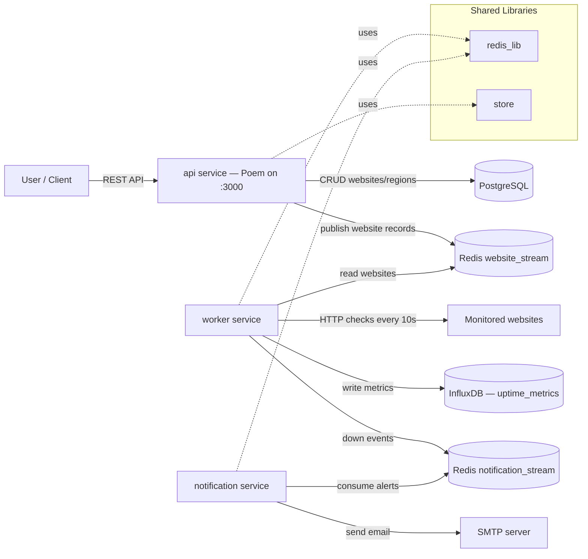

# Better Uptime

### A website monitoring app

## Architecture Diagram

### Component Notes

- **api**: handles CRUD for websites and regions
- **worker**: polls website URLs, writes uptime metrics to InfluxDB, and pushes down events to Redis.
- **notification**: consumes Redis notification events and sends email alerts.
- **redis_lib**: shared Redis stream access layer used by worker and notification.
- **db_processor**: just scaffolded
