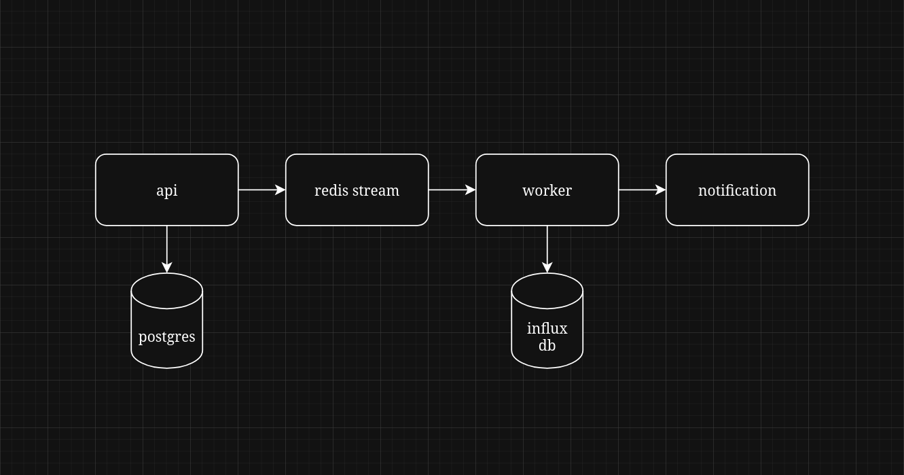

# BetterUp

High-performance distributed website uptime monitoring system.

## Overview

Rust-native infrastructure service that continuously monitors website availability across multiple geographic regions, persists time-series metrics to InfluxDB, and dispatches email notifications upon failure detection.

## Architecture



## Services

| Service | Description |
|---------|-------------|
| `api` | HTTP REST API built on Poem- handles user authentication (JWT), website CRUD, and region management. |
| `worker` | Background health-check processor. Checks all websites every 10 seconds, writes metrics to InfluxDB, queues notifications for down sites with cooldown enforcement. |
| `notification` | Email alert consumer. Polls Redis notification stream and dispatches SMTP alerts to website owners. |
| `store` | PostgreSQL data layer- user credentials, website registrations, region metadata. |
| `redis_lib` | Redis stream utilities- job queues, consumer-group management, cooldown state. |

## Quick Start

```bash
cp .env.example .env
# Configure: DATABASE_URL, REDIS_URL, INFLUXDB_*, JWT_SECRET, SMTP_*

cargo build --release

cargo run -p api         # HTTP API on port 5000
cargo run -p worker     # Health-check worker
cargo run -p notification  # Email dispatcher
```

## API Endpoints

| Method | Endpoint | Description |
|--------|----------|-------------|
| POST | `/auth/signup` | Register new user |
| POST | `/auth/signin` | Authenticate, returns JWT |
| GET | `/websites` | List user's websites |
| POST | `/websites` | Register website for monitoring |
| GET | `/websites/:id` | Get single website |
| PATCH | `/websites/:id` | Update website |
| DELETE | `/websites/:id` | Remove website |
| GET | `/regions` | List all regions |
| POST | `/regions` | Create region |

All `/websites` and `/regions` endpoints require `Authorization: Bearer <jwt>` header.

## Configuration

| Variable | Description |
|----------|-------------|
| `DATABASE_URL` | PostgreSQL connection string |
| `REDIS_URL` | Redis connection string |
| `INFLUXDB_URL` | InfluxDB server URL |
| `INFLUXDB_ORG` | InfluxDB organization |
| `INFLUXDB_TOKEN` | InfluxDB API token |
| `JWT_SECRET` | Secret for JWT signing |
| `SMTP_USER` | SMTP username (sender address) |
| `SMTP_PASS` | SMTP password |
| `SMTP_HOST` | SMTP relay hostname |
| `PORT` | HTTP server port (default: 5000) |

## Monitoring

Metrics written to InfluxDB:

- **Measurement**: `website_tick`
- **Tags**: `website_id`, `region_id`
- **Fields**: `response_time_ms` (i64), `status` (string: "Up" or "Down")

## Alert Cooldown

30-minute cooldown enforced per website-region pair when marked as down. State stored in Redis with TTL.

## License

MIT
